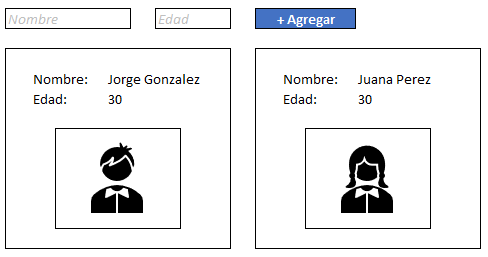

# Desafío jpolivares

## Imagen de la solución

## Contexto del desafío

Formulario de registro de usuarios

## Historias de usuario

### Descripción

**COMO:** Administrador del sistema    
**QUIERO:** Registrar nombre y edad de usuario  
**PARA:** Visualizar los registros posteriormete  

### Criterios de aceptación

**DADO:** un administrador que ingresa nombre y edad de un usuario  
**CUANDO:** presiona el botón +Agregar  
**ENTONCES:** se despliega una nueva carta con la información ingresada  
**Y:** los datos son almacenados  

**DADO:** un administrador que ingresa al sistema  
**CUANDO:** ingresa a la pantalla inicial  
**ENTONCES:** los registros almacenados previamente son listados  

## Restricciones técnicas

- El frontend se debe desarrollar con React 
- El backend se debe desarrollar con nodejs
- La comunicación entre el frontend y el backend debe ser resuelta a través de un ***API RESTful***
- Los cambios deben ser almacenados en una rama con el nombre ***jpolivares***

## **Límite de tiempo 3hrs.**
